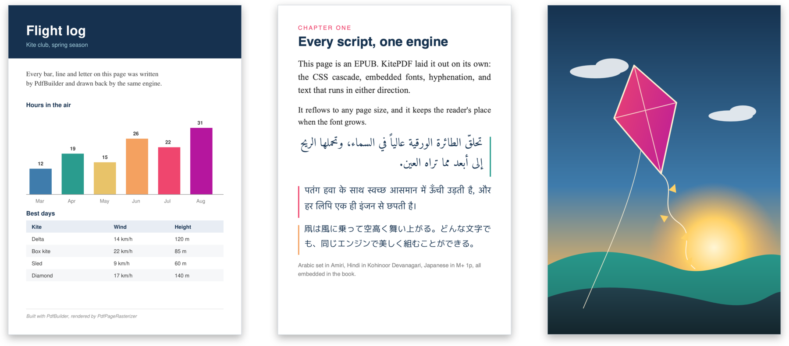

<p align="center">
  
</p>

<p align="center">
  A pure-Kotlin document engine for Kotlin Multiplatform: read, create, edit and
  render PDFs, and read reflowable EPUB 2/3, from <code>commonMain</code>.
</p>

<p align="center">
  <a href="https://central.sonatype.com/artifact/io.github.yuroyami/kitepdf"></a>
  <a href="https://github.com/yuroyami/KitePDF/actions/workflows/ci.yml"></a>
  <a href="https://yuroyami.github.io/KitePDF/"></a>
  <a href="https://kotlinlang.org"></a>
  <a href="LICENSE"></a>
</p>

<p align="center">
  <b><a href="https://yuroyami.github.io/KitePDF/">Documentation</a></b> · a guide for each task, plus the generated API reference.
</p>

<p align="center">
  
  <br>
  <sub>A PDF, an EPUB and an SVG, each rendered by KitePDF.</sub>
</p>

## What you get

KitePDF brings its own document engine, written in Kotlin from the ground up. There is no
platform PDF library underneath, no JNI and no native binary. So the same code runs on
Android, iOS, the desktop JVM, macOS, Linux, Windows and the web.

<table>
<tr>
<td width="33%" valign="top">

**Open**<br>
PDF, EPUB 2 and 3, CBZ comic archives, SVG, and XPS or OpenXPS, all through one `KiteDoc.open` call.

</td>
<td width="33%" valign="top">

**Show**<br>
One Compose Multiplatform composable for every format, or pages rendered to PNG without a screen.

</td>
<td width="33%" valign="top">

**Read**<br>
The text of any page with its position, and search across a whole document.

</td>
</tr>
<tr>
<td width="33%" valign="top">

**Change**<br>
Fill forms, edit pages, redact for real, encrypt, and prepare a signature.

</td>
<td width="33%" valign="top">

**Create**<br>
New PDFs with the standard fonts, your own fonts and your images.

</td>
<td width="33%" valign="top">

**Run**<br>
The JavaScript inside PDF forms, so totals add up and fields format themselves. Experimental.

</td>
</tr>
</table>

Here is a PDF made, opened and read back:

```kotlin
import io.github.yuroyami.kitepdf.PdfDocument
import io.github.yuroyami.kitepdf.writer.PdfBuilder
import io.github.yuroyami.kitepdf.writer.StandardFont

val bytes = PdfBuilder()
    .page { text(StandardFont.Helvetica, 24.0, 72.0, 700.0, "Hello from PdfBuilder") }
    .build()

val doc = PdfDocument.open(bytes)
doc.pageCount                // 1
doc.pages[0].extractText()   // "Hello from PdfBuilder"
```

`KitePDF.open(bytes)` is a short alias for `PdfDocument.open(bytes)`. The docs use
`PdfDocument`, because it also has the password overload, `openOrNull` and `edit()`.

> [!NOTE]
> KitePDF is not at 1.0 yet, so the API can still change between minor versions.

## Install

Every artifact is on Maven Central at `0.11.0`. Most apps need just two lines: one to
open documents, and one to show them.

```kotlin
commonMain.dependencies {
    implementation("io.github.yuroyami:kitepdf:0.11.0")                  // opens every format
    implementation("io.github.yuroyami:kitepdf-compose-viewer:0.11.0")   // shows them with KiteDocView
}
```

Here is everything you can add:

```kotlin
kotlin {
    sourceSets {
        commonMain.dependencies {
            // Every format: PDF, EPUB, CBZ, SVG, XPS and OpenXPS
            implementation("io.github.yuroyami:kitepdf:0.11.0")

            // Or one format only
            implementation("io.github.yuroyami:kitepdf-pdf:0.11.0")
            implementation("io.github.yuroyami:kitepdf-epub:0.11.0")
            implementation("io.github.yuroyami:kitepdf-cbz:0.11.0")
            implementation("io.github.yuroyami:kitepdf-svg:0.11.0")
            implementation("io.github.yuroyami:kitepdf-xps:0.11.0")

            // Optional, depending on what you build
            implementation("io.github.yuroyami:kitepdf-compose-viewer:0.11.0")   // KiteDocView for Compose Multiplatform
            implementation("io.github.yuroyami:kitepdf-native-renderer:0.11.0")  // page-to-image on the platform canvas
            implementation("io.github.yuroyami:kitepdf-skia-renderer:0.11.0")    // page-to-image on Skia (on Android, add one repository)
            implementation("io.github.yuroyami:kitepdf-javascript:0.11.0")       // runs the JavaScript inside PDFs (pulls in KiteJS)
            implementation("io.github.yuroyami:kitepdf-net:0.11.0")              // loads documents from a URL (add a Ktor engine too)
        }
    }
}
```

### What else you need

> [!IMPORTANT]
> Two artifacts need something extra. Without it, the build or the download fails.

| If you add | You also need |
| --- | --- |
| `kitepdf-net` | **A Ktor client engine** such as `io.ktor:ktor-client-cio:3.6.0`, or the OkHttp, Darwin or JS engine. KitePDF downloads through the engine you pick. |
| `kitepdf-skia-renderer` on Android | **One more repository**: `maven("https://maven.pkg.jetbrains.space/public/p/compose/dev")`. Skia's Android build lives there, not on Maven Central. |

Good to know:

- `kitepdf-core` comes with every document artifact, so you never add it yourself.
- The document artifacts depend only on `kotlin-stdlib` and KiteImage, which decodes the images.
- In a plain Android or JVM project, put the same lines in your usual `dependencies { }` block.

## A quick tour

### Open a document

```kotlin
import io.github.yuroyami.kitepdf.PdfDocument
import io.github.yuroyami.kitepdf.document.KiteDoc

val doc = PdfDocument.open(bytes)      // a PDF; PdfDocument.open(bytes, "secret") if it is locked
val any = KiteDoc.open(bytes)          // any format: KitePDF finds out which by itself
KiteDoc.formatOf(bytes)                // Pdf, Epub, Cbz, Svg, Xps, or null
```

`open` throws when it cannot read a file, and `openOrNull` returns `null` instead. A
damaged or cut-off PDF usually still opens. When its table of objects is broken, KitePDF
scans the whole file for the objects instead.

Bytes are the usual way in, but not the only one. You can also pass a file path, a
`File` or an `InputStream`, an Android content `Uri`, `NSData` or `NSURL` on Apple,
Base64 or a `data:` URI, and a URL through `kitepdf-net`. Each one also has an
`...OrNull` form. See [Loading](https://yuroyami.github.io/KitePDF/loading/) for which
platform takes which.

### Show it in Compose

With `kitepdf-compose-viewer`, one composable shows any document, whatever its format:

```kotlin
import androidx.compose.foundation.gestures.Orientation
import androidx.compose.foundation.layout.fillMaxSize
import androidx.compose.runtime.Composable
import androidx.compose.ui.Modifier
import io.github.yuroyami.kitepdf.compose.*
import io.github.yuroyami.kitepdf.core.KiteDocument

@Composable
fun Viewer(doc: KiteDocument) {
    KiteDocView(
        state = rememberKiteDocViewState(doc),
        modifier = Modifier.fillMaxSize(),
        layout = KiteDocLayout.Paged(Orientation.Horizontal),   // or KiteDocLayout.Continuous()
        zoomSpec = KiteZoomSpec(maxZoom = 6f),
    )
}
```

It zooms, selects text, follows links inside the document and highlights search hits. See
[Compose viewer](https://yuroyami.github.io/KitePDF/compose-viewer/) for everything it can do.

### Read and search text

```kotlin
import io.github.yuroyami.kitepdf.text.search

val page = doc.pages[0]

page.extractText()            // the page as plain text
page.structuredText.blocks    // blocks of lines of spans, each with its bounds
page.search("invoice")        // the hits on this page
doc.search("invoice")         // every hit in the document, page by page
```

Each span knows the edges of its characters, so you can draw a text selection. The rest
of the document is there too: `doc.info.title`, `doc.bookmarks`, page labels,
attachments, permissions, XMP metadata and the form fields.

### Fill forms, edit and redact

`doc.edit()` gives you a `PdfEditor`, which collects your changes. `saveIncremental()`
adds them to the end of the original file, and `saveRewritten()` writes a fresh, clean
file.

```kotlin
import io.github.yuroyami.kitepdf.core.KiteRectangle

val filled = doc.edit().apply {
    setTextFieldValue(doc.formField("ApplicantName")!!, "Jane Doe")
    setCheckbox(doc.formField("AgreeToTerms")!!, checked = true)
    setChoiceValue(doc.formField("Country")!!, "Norway")
}.saveIncremental()

val redacted = doc.edit().apply {
    redactRegions(doc.pages[0], listOf(KiteRectangle(72.0, 700.0, 320.0, 720.0)))
}.saveRewritten()
```

Redaction really removes what lies inside the region: the text, images and vector paths,
and the content of annotations and form fields there. It does not just paint a black box
over them. That is why it needs `saveRewritten()`. `saveIncremental()` refuses, because
the old content would still be in the file.

### Create a PDF

`PdfBuilder` writes a file page by page, as in the first example. It can also:

- fill in the title and author: `setInfo(title = "Report", author = "Jane Doe")`
- draw an image inside `page { }`: `drawImage(logo, x = 400.0, y = 700.0, width = 96.0, height = 48.0)`, with `logo = PdfImage.rgba(pixels, width = 128, height = 64)`
- use any of the 14 standard fonts, or your own with `EmbeddedFont.load(bytes)`, which embeds only the glyphs you use
- encrypt the file with AES-256: `encrypt(userPassword, ownerPassword, random = platformCsprng)`

Encryption asks for a secure random source on purpose. KitePDF never quietly falls back to
Kotlin's `Random.Default` for keys. Reading works with RC4, AES-128 and AES-256.

### Read an EPUB

```kotlin
import io.github.yuroyami.kitepdf.epub.EpubDocument

val book = EpubDocument.open(bytes, pageWidth = 400.0, pageHeight = 640.0)
book.tableOfContents        // from nav.xhtml (EPUB 3) or toc.ncx (EPUB 2)
book.search("chapter")
book.withFontSize(15.0)     // lays the book out again; the old layout stays valid
```

KitePDF lays out the HTML and CSS itself:

- the full CSS cascade
- embedded TTF, OTF, WOFF and WOFF2 fonts
- hyphenation in German, French, Spanish, Italian, Portuguese and Dutch
- tables, floats, ruby, and right-to-left and vertical text
- text shaping that matches HarfBuzz for complex scripts such as Arabic and the Indic scripts

Big books open fast, because KitePDF lays out one chapter at a time. A reader who comes
back to chapter 20 waits for chapter 20, not for the whole book. On a 26-chapter book, that
cuts the wait from 986 ms to 3 ms. A saved place also survives a change of font size.

```kotlin
val state = rememberKiteDocViewState(book, savedBookmark)   // opens at the saved place
KiteDocView(state, Modifier.fillMaxSize())

savedBookmark = state.currentBookmark()                    // save it when the app pauses
```

### Render a page to an image

```kotlin
import io.github.yuroyami.kitepdf.nativerenderer.AwtPdfRasterizer
import io.github.yuroyami.kitepdf.skia.PdfPageRasterizer

val awtPng = AwtPdfRasterizer.encodeToPng(doc.pages[0], scale = 2.0)    // JVM
val skiaPng = PdfPageRasterizer.encodeToPng(doc.pages[0], scale = 2.0)  // any Skia target
```

`kitepdf-native-renderer` draws with the platform's own canvas: AWT on the JVM,
`android.graphics`, CoreGraphics on Apple, and Canvas2D in the browser. `kitepdf-skia-renderer`
draws with Skia, alike on every target, and renders EPUB pages too with
`EpubPageRasterizer`.

### Run the JavaScript in a PDF

Many forms add up totals and format their fields with JavaScript. `kitepdf-javascript`
runs those scripts on [KiteJS](https://github.com/yuroyami/KiteJS), a JavaScript engine
written in Kotlin. It is experimental, and it runs the scripts of PDF forms only.

```kotlin
PdfScriptRunner(doc, onAlert = { alert -> showDialog(alert.message); 1 }).use { runner ->
    runner.runDocumentOpen()                 // the document's own scripts, then its open action
    runner.setFieldValue("price", "1200")    // runs the field's scripts, as a viewer would
    runner.formattedValue("total")           // "$1,200.00", as the form worked it out
}
```

See [JavaScript](https://yuroyami.github.io/KitePDF/javascript/) for what scripts can reach.

## Platforms

The document artifacts run on every target. The viewer and the renderers cover fewer targets,
and that difference is the usual reason a first build does not resolve.

| Artifact | Where it runs |
| --- | --- |
| `kitepdf`, `-pdf`, `-epub`, `-cbz`, `-svg`, `-xps`, `-core` | Android (minSdk 21), JVM, iOS, macOS, tvOS, watchOS, Linux, Windows, Android Native, JS and Wasm |
| `-compose-viewer` | Android (minSdk 24), JVM, iOS arm64 and simulator, macOS arm64, and JS and wasmJs in the browser |
| `-native-renderer` | Android (minSdk 29), JVM, iOS, macOS arm64, tvOS, and JS in the browser |
| `-skia-renderer` | Android (minSdk 21), JVM, iOS, macOS arm64, tvOS, Linux, and JS and wasmJs in the browser |
| `-javascript` | Every target KiteJS builds for: Android, JVM, iOS, macOS arm64, Linux, Windows, JS and wasmJs |

[Platform support](https://yuroyami.github.io/KitePDF/platforms/) has the full list,
with the reason behind each gap.

## Good to know

<details>
<summary><b>Known limits</b>: what KitePDF does not do yet, in one table</summary>
<br>

| Topic | What to expect |
| --- | --- |
| Annotations | You can read them, but there is no API to create them yet. |
| Signing | `PdfSigner` prepares the signature field and its byte range. Your app supplies the signature itself, and KitePDF does not check signatures. |
| Redaction | A few things survive, such as a large background fill and a clipping path's outline. The [editing guide](https://yuroyami.github.io/KitePDF/editing/#redaction-limitations) lists them all. |
| Encryption | Files encrypted with RC4 open, but only AES files can be edited. New files use AES-256. |
| Colour | ICC profiles and rendering intents apply. Overprint is not simulated. |
| Text | Text comes as blocks, lines and spans, with no word splitting and no tag tree. |
| Shaping | Hangul jamo are not composed into syllables. A font without its own shaping tables gets no Arabic or Thai fallback forms. |
| EPUB | A book that mixes fixed-layout and reflowable chapters is laid out as reflowable. English hyphenation uses a small word list. |
| Browser | With Canvas2D, an image appears one frame late, because the browser decodes it in the background. |
| Rendering | AWT on the JVM and Skia are the two complete renderers. |
| CI | CI runs the tests on the JVM, the Android host, the iOS simulator, macOS, Node and a headless browser. Android devices, Wasm, and native Linux and Windows are not tested there. |

</details>

## How it is tested

Around 2,000 tests run on the JVM alone. A differential test renders a set of real PDFs with
KitePDF and with MuPDF, and compares them page by page. On the latest run of 40 pages, the
mean difference was 0.0007 on a scale where 0 means identical. A parity check adds PDFium
as a second reference, and it fails where MuPDF and PDFium agree and KitePDF does not. See
[DIFFTEST.md](kitepdf-native-renderer/DIFFTEST.md). The PDFs themselves are not in the
repository, so a fresh checkout cannot repeat that run.

Found a PDF that renders wrong? Open an issue with the file attached. Every rendering fix
comes with a test that keeps it fixed.

## Sample app

`sample/` is a Compose Multiplatform app that opens a PDF and tries out the API. The
desktop version runs on its own. The Android and iOS entry points are meant to go into a
host project of your own.

## License

Apache-2.0. KitePDF holds no third-party source code. It does bundle some third-party
data, each under its own license, and [NOTICE](NOTICE) lists every piece and where it
comes from:

- the URW base 35 fonts, which draw the 14 standard fonts, under the SIL Open Font License 1.1
- PDFium's table for DeviceCMYK, under PDFium's BSD-style license
- Adobe's glyph lists and CJK CMaps, under BSD-3-Clause
- the hyphenation patterns of the hyph-utf8 project, each under the license in its file header

Part of the Kite family: [KiteCore](https://github.com/yuroyami/KiteCore),
[KiteImage](https://github.com/yuroyami/KiteImage),
[KiteQR](https://github.com/yuroyami/KiteQR).
